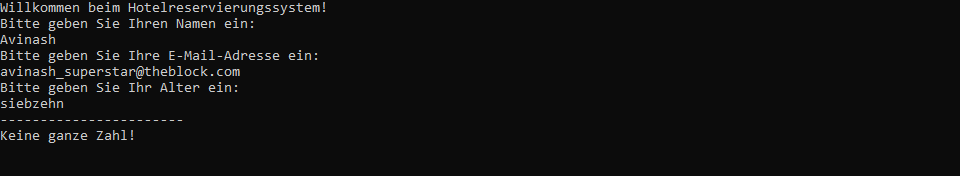
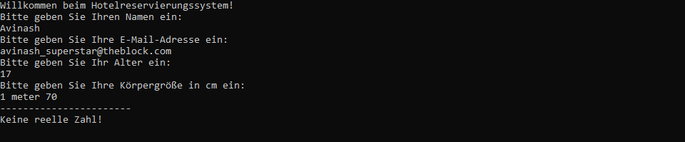
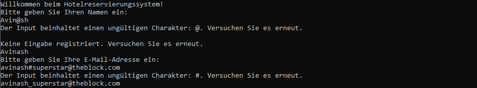
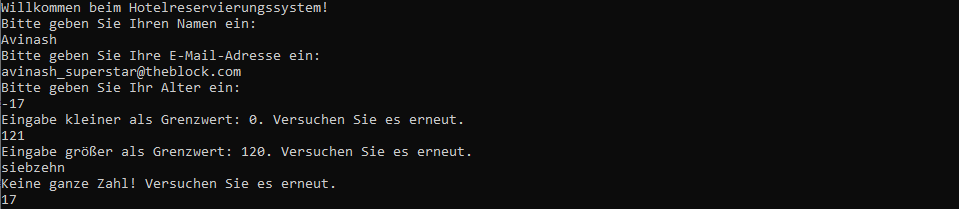
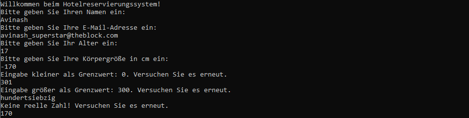

  
<h1 style="margin:10;">Statische Methoden</h1>

[Modelunternehmen](https://github.com/GSO-SW/public_content_gso/blob/df4f6d0abb7b1a82245f5ad9963ce88484c0e4a1/EducationMaterials/Csharp/Situations-Company/Modellunternehmen-Capcom.jpg)   

**Ziel der Aufgabe:**
Sie sind Teil des Entwicklungsteams eines Hotelreservierungssystems und sollen die Eingaberoutinen für die Kundendaten modularisieren. Der Code zur Abfrage der Kundendaten liegt bereits vor, aber er ist noch nicht gut organisiert. Ihre Aufgabe ist es, die Eingaberoutinen für verschiedene Datentypen zu modularisieren, um den Code sauberer und wartbarer zu machen.

### Aufgabe 1: Eingaberoutine modularisieren 

Der vorhandene [Code](./Aufgabe1_ExeptionHandling/Program.cs) fragt den Kunden nach Name, E-Mail-Adresse, Alter und Körpergröße. Sie müssen die Eingaberoutinen schreiben, um diese Informationen korrekt zu erfassen. :bust_in_silhouette:**Einzelarbeit**  | :clock130: **30 min**

| [Bezeichnung](https://github.com/GSO-SW/public_content_gso/wiki/Methoden#signatur-einer-methode)          | [Eingabeparameter](https://github.com/GSO-SW/public_content_gso/wiki/Methoden#parameter%C3%BCbergabe) | [Rückgabeparameter](https://github.com/GSO-SW/public_content_gso/wiki/Methoden#r%C3%BCckgabetypen) | [Zugriffsmodifizierer](https://github.com/GSO-SW/public_content_gso/wiki/Methoden#zugriffsmodifikatoren) | [Statisch](https://github.com/GSO-SW/public_content_gso/wiki/Methoden#statische-und-instanzmethoden) |
|----------------------|------------------|-------------------|----------------------|----------|
| EingabeRoutineString | keine            | string            | public               | Ja       |
| EingabeRoutineInt32  | keine            | int               | public               | Ja       |
| EingabeRoutineDouble | keine            | double            | public               | Ja       |


> :information_source: **Hinweis**:exclamation:
> + Beachten Sie, dass Sie die Ausgabe unter der gestrichelten Linie erzeugen müssen, um die Aufgabe zu bestehen
> + Halten Sie die Bezeichnungen der Methoden ein, damit der Test sie aufrufen kann.
> + Nutzen Sie ggf. folgende Informationsquelle [gso-wiki](https://github.com/GSO-SW/public_content_gso/wiki/Methoden#r%C3%BCckgabetypen).   
> + Nutzen Sie zur Lesebestätigung ```Console.ReadLine()```, sonst kann es zu Problemen in der Testumgebung kommen.


**a)Eingabe des Namens und der E-Mail-Adresse:**   
Schreiben Sie eine Methode **'EingabeRoutineString()'**, die eine Zeichenfolge vom Benutzer einliest und zurückgibt. 


**b)Eingabe des Alters:**   
Schreiben Sie eine Methode **'EingabeRoutineInt32()'**, die eine Ganzzahl vom Benutzer einliest und zurückgibt. Die Methode sollte in der Lage sein, Fehler zu behandeln, wenn die Eingabe keine gültige Ganzzahl ist. Wenn die Eingabe nicht in einen Integer konvertiert werden kann, soll folgende Fehlermedlung erscheinen:   
```Keine ganze Zahl!```   
Zudem soll bei einem Fehler der Wert **0** von der Methode zurück gegeben werden.

Beispiel Ausgabe/Ergebnis:

  

**c)Eingabe des Namens und der E-Mail-Adresse:**    
Schreiben Sie eine Methode **'EingabeRoutineDouble()'**, die eine Fließkommazahl vom Benutzer einliest und zurückgibt. Die Methode sollte in der Lage sein, Fehler zu behandeln, wenn die Eingabe keine gültige Fließkommazahl ist. Wenn die Eingabe nicht in eine Double konvertiert werden kann, soll folgende Fehlermedlung erscheinen:   
```Keine reelle Zahl!```   
Zudem soll bei einem Fehler der Wert **0.0** von der Methode zurück gegeben werden.

Beispiel Ausgabe/Ergebnis:

  

---
  
### Aufgabe 2: Eingabewiederholung und Parameter

In einem Hotelreservierungssystem ist es unerlässlich, dass Benutzereingaben genau validiert werden, um sicherzustellen, dass sie den erwarteten Anforderungen entsprechen. Zum Beispiel sollte der Name nicht leer sein, das Alter sollte nicht kleiner als 0 sein, und es können spezifische Anforderungen für die E-Mail-Adresse und die Körpergröße gelten. Diese Anforderungen können vom Aufrufer festgelegt werden, um eine präzise Kontrolle über die eingegebenen Daten zu gewährleisten.:bust_in_silhouette:**Einzelarbeit**  | :clock130: **45 min**

| [Bezeichnung](https://github.com/GSO-SW/public_content_gso/wiki/Methoden#signatur-einer-methode) | [Eingabeparameter](https://github.com/GSO-SW/public_content_gso/wiki/Methoden#parameter%C3%BCbergabe)              | [Rückgabeparameter](https://github.com/GSO-SW/public_content_gso/wiki/Methoden#r%C3%BCckgabetypen) | [Zugriffsmodifizierer](https://github.com/GSO-SW/public_content_gso/wiki/Methoden#zugriffsmodifikatoren) | [Statisch](https://github.com/GSO-SW/public_content_gso/wiki/Methoden#statische-und-instanzmethoden) |
|----------------------|---------------------------------------------------|-------------------|----------------------|----------|
| EingabeRoutineString | [params string[] invalids](https://github.com/GSO-SW/public_content_gso/wiki/Methoden#params-modifizierer-f%C3%BCr-variable-argumente)                          | string            | public               | Ja       |
| EingabeRoutineInt32  | int min, int max                                  | int               | public               | Ja       |
| EingabeRoutineDouble | double min, double max                            | double            | public               | Ja       |

> :information_source: **Hinweis**:exclamation:
> + Beachten Sie, dass Sie die Ausgabe unter der gestrichelten Linie erzeugen müssen, um die Aufgabe zu bestehen
> + Nutzen Sie ggf. folgende Informationsquelle [gso-wiki](https://github.com/GSO-SW/public_content_gso/wiki/Methoden#r%C3%BCckgabetypen).   
> + Nutzen Sie zur Lesebestätigung ```Console.ReadLine()```, sonst kann es zu Problemen in der Testumgebung kommen.

**a)Eingabe des Namens und der E-Mail-Adresse:**   
Liest eine Zeichenfolge vom Benutzer ein und überprüft, ob sie ungültige Zeichen enthält, die als Parameter übergeben werden. Wenn die Eingabe ungültig ist, fordert die Methode den Benutzer auf, es erneut zu versuchen. Die Methode gibt die gültige Eingabe zurück.   
**Fehlermeldungen:**     
```Keine Eingabe registriert. Versuchen Sie es erneut.```   
```Der Input beinhaltet einen ungültigen Charakter: {Zeichen einfügen}. Versuchen Sie es erneut.```

Beispiel Ausgabe/Ergebnis für die Parameterübergabe von **'@' und '#'**:

  

**b)Eingabe des Alters**   
Liest eine Ganzzahl im Bereich zwischen den übergebenen minimalen und maximalen Werten ein. Wenn die Eingabe außerhalb dieses Bereichs liegt, fordert die Methode den Benutzer auf, es erneut zu versuchen. Die Methode gibt die gültige Eingabe zurück.    
**Fehlermeldungen:**     
```Eingabe kleiner als Grenzwert: {min}. Versuchen Sie es erneut.```   
```Eingabe größer als Grenzwert: {max}. Versuchen Sie es erneut.```   
```Keine ganze Zahl! Versuchen Sie es erneut.```   

Beispiel Ausgabe/Ergebnis für die Parameterübergabe von **'min = 0'** und **'max = 120'**:

  

**c)Eingabe der Größe:**   
 Liest eine Gleitkommazahl im Bereich zwischen den übergebenen minimalen und maximalen Werten ein. Wenn die Eingabe außerhalb dieses Bereichs liegt, fordert die Methode den Benutzer auf, es erneut zu versuchen. Die Methode gibt die gültige Eingabe zurück.
**Fehlermeldungen:**   
```Eingabe kleiner als Grenzwert: {min}. Versuchen Sie es erneut.```   
```Eingabe größer als Grenzwert: {max}. Versuchen Sie es erneut.```   
```Keine reelle Zahl! Versuchen Sie es erneut.```   

Beispiel Ausgabe/Ergebnisfür die Parameterübergabe von **'min = 0'** und **'max = 300'**:

  

---

### Aufgabe 3: Methodenüberladung

In diesem Schritt soll die Methoden die Sie entwickelt haben, in eine Methode zusammengefasst werden. Diese [Methodenüberladung](https://github.com/GSO-SW/public_content_gso/wiki/Methoden#methoden%C3%BCberladung) ermöglicht es dem Kunden eine übersichtlichere Bibliothek zur Verfügung zu stellen. :bust_in_silhouette:**Einzelarbeit**  | :clock130: **10 min**


| [Bezeichnung](https://github.com/GSO-SW/public_content_gso/wiki/Methoden#signatur-einer-methode) | [Eingabeparameter](https://github.com/GSO-SW/public_content_gso/wiki/Methoden#parameter%C3%BCbergabe)              | [Rückgabeparameter](https://github.com/GSO-SW/public_content_gso/wiki/Methoden#r%C3%BCckgabetypen) | [Zugriffsmodifizierer](https://github.com/GSO-SW/public_content_gso/wiki/Methoden#zugriffsmodifikatoren) | [Statisch](https://github.com/GSO-SW/public_content_gso/wiki/Methoden#statische-und-instanzmethoden) |
|----------------------|---------------------------------------------------|-------------------|----------------------|----------|
| EingabeRoutine | [params string[] invalids](https://github.com/GSO-SW/public_content_gso/wiki/Methoden#params-modifizierer-f%C3%BCr-variable-argumente)                          | string            | public               | Ja       |
| EingabeRoutine | int min, int max                                  | int               | public               | Ja       |
| EingabeRoutine | double min, double max                            | double            | public               | Ja       |


> :information_source: **Hinweise**:exclamation:
> + Committen und pushen Sie ihre Arbeit oder fügen Sie diese über die Github Oberfläche in Ihr Repository ein.

---
  
# :100: Erfolgskriterien
  
+ Eingesetzten Quellcode kommentieren
+ Quellcode schreiben der lesbar ist und mit Hilfe einer logischen Folge das Problem löst
+ Programmausgabe die korrekt, lesbar und richtig formatiert ist 
